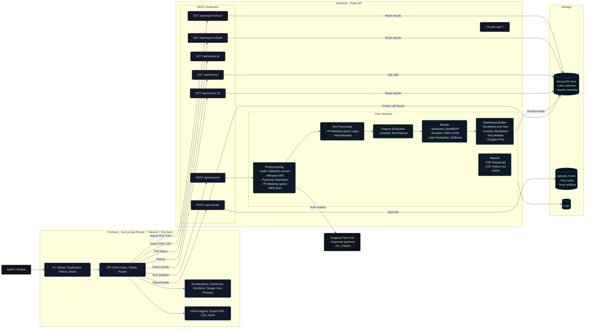
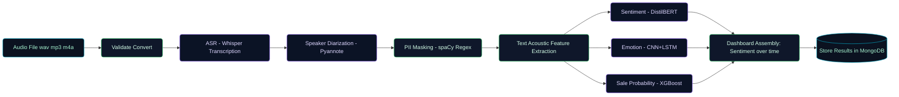
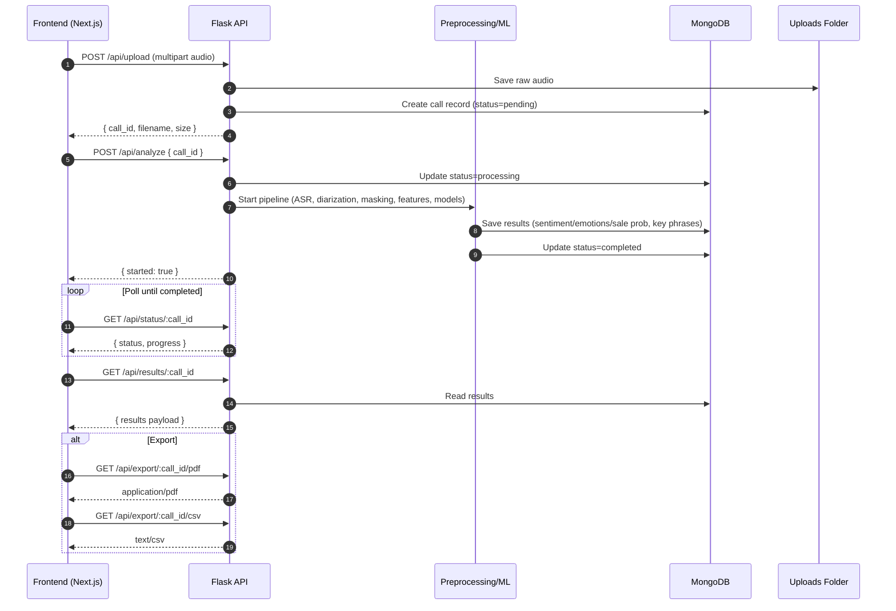

## FYP Architecture Diagrams

This document Mermaid diagrams for Call Analysis FYP. 

### 1) System Block Diagram (End-to-End Architecture)

### 2) Processing Pipeline (Detailed)

### 3) Request Lifecycle (Upload → Analyze → Results)

